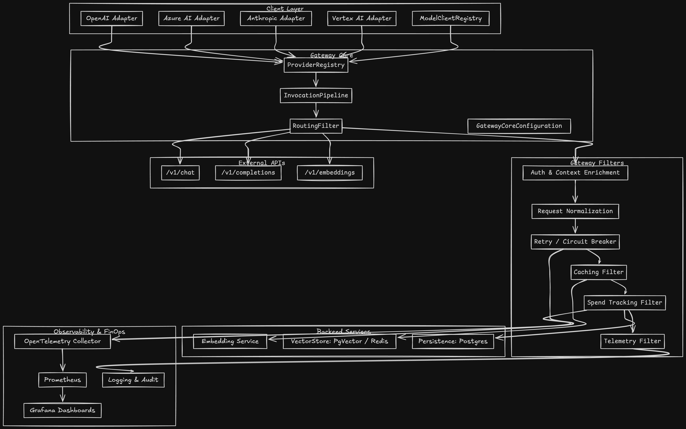
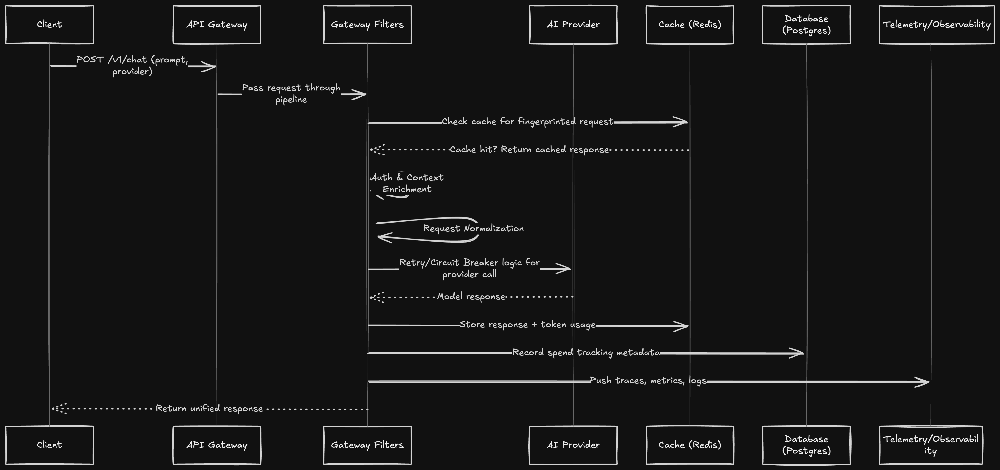

## Spring Cloud AI API Gateway

````markdown
# AI API Gateway (Spring Cloud Reactive)

A unified, reactive AI API Gateway built on **Spring Boot**, **Spring Cloud Gateway**, and **WebFlux**.  
Supports multiple AI providers with reliability, caching, spend tracking, and observability built in.

---

## Prerequisites

- **Install Java & Maven**  
  Ensure **Java 21+** and **Maven 3.9+** are installed.

- **Set API Credentials**  
  API keys should be exported as environment variables before startup:
  ```bash
  export OPENAI_API_KEY=...       # Optional
  export GEMINI_API_KEY=...       # Required if using Gemini
````

* **Start Backing Services**
  Backing services defined in `samples/src/main/resources/application.yml` must be running:

  * **Redis**: `localhost:6379`
  * **Postgres**: `jdbc:postgresql://localhost:5432/ai_gateway` (user/password: `ai_gateway`)

  Teams may run their own instances or update the YAML configuration to match their environment.

---

## Build & Run

* **Compile All Modules**
  Compile the project to pick up generated sources and tests:

  ```bash
  mvn -pl samples -am compile
  ```

* **Run the Sample Application**
  Start the Spring Boot application, which exposes the `/v1/chat` endpoint:

  ```bash
  mvn -pl samples spring-boot:run
  ```

---

## Usage

Once the application is running, the unified chat endpoint can be called as follows:

```bash
curl -X POST http://localhost:8080/v1/chat \
  -H 'Content-Type: application/json' \
  -d '{"provider":"gemini","model":"gemini-1.5-flash","prompt":"Hello!"}'
```

If the `provider` field is omitted, the routing filter automatically selects the first enabled model that matches.

---

## Architecture Diagram



---

## Optional Configurations

1. **Override Datastore Credentials**
   Hosts or credentials can be changed using `SPRING_*` environment variables or by editing
   `samples/src/main/resources/application.yml`.

2. **Skip Redis/Postgres**
   Caching and spend tracking filters can be temporarily disabled for smoke testing by commenting out the relevant beans in `FinOpsConfiguration`.

---

## Sequence Diagram




**Docker File** `docker-compose.yml`:

```yaml
version: '3.9'
services:
  postgres:
    image: postgres:15
    container_name: ai-gateway-postgres
    environment:
      POSTGRES_DB: ai_gateway
      POSTGRES_USER: ai_gateway
      POSTGRES_PASSWORD: ai_gateway
    ports:
      - "5432:5432"
    volumes:
      - postgres_data:/var/lib/postgresql/data
    healthcheck:
      test: ["CMD-SHELL", "pg_isready -U ai_gateway -d ai_gateway"]
      interval: 10s
      timeout: 5s
      retries: 5

  redis:
    image: redis:7
    container_name: ai-gateway-redis
    ports:
      - "6379:6379"
    volumes:
      - redis_data:/data
    healthcheck:
      test: ["CMD", "redis-cli", "ping"]
      interval: 5s
      timeout: 3s
      retries: 5

  otel-collector:
    image: otel/opentelemetry-collector-contrib:0.92.0
    container_name: ai-gateway-otel
    command: ["--config=/etc/otel-collector-config.yaml"]
    volumes:
      - ./otel-collector-config.yaml:/etc/otel-collector-config.yaml
    ports:
      - "4317:4317"   # OTLP gRPC
      - "4318:4318"   # OTLP HTTP

  prometheus:
    image: prom/prometheus:latest
    container_name: ai-gateway-prometheus
    volumes:
      - ./prometheus.yml:/etc/prometheus/prometheus.yml
    ports:
      - "9090:9090"

  grafana:
    image: grafana/grafana:latest
    container_name: ai-gateway-grafana
    ports:
      - "3000:3000"
    environment:
      GF_SECURITY_ADMIN_USER: admin
      GF_SECURITY_ADMIN_PASSWORD: admin
    volumes:
      - grafana_data:/var/lib/grafana

volumes:
  postgres_data:
  redis_data:
  grafana_data:
```

---

### Supporting Config Files

**otel-collector-config.yaml** (simple OTEL pipeline):

```yaml
receivers:
  otlp:
    protocols:
      grpc:
      http:

exporters:
  prometheus:
    endpoint: "0.0.0.0:9464"
  logging:
    loglevel: debug

processors:
  batch:

service:
  pipelines:
    metrics:
      receivers: [otlp]
      processors: [batch]
      exporters: [prometheus, logging]
    traces:
      receivers: [otlp]
      processors: [batch]
      exporters: [logging]
```

**prometheus.yml** (scrape OTEL metrics):

```yaml
global:
  scrape_interval: 15s

scrape_configs:
  - job_name: 'otel-collector'
    static_configs:
      - targets: ['otel-collector:9464']
```

---

### Running the Stack

From the project root:

```bash
docker compose up -d
```

Services started:

* **Postgres** on `localhost:5432`
* **Redis** on `localhost:6379`
* **OpenTelemetry Collector** on `4317` / `4318`
* **Prometheus** UI at [http://localhost:9090](http://localhost:9090)
* **Grafana** UI at [http://localhost:3000](http://localhost:3000) (user/pass: admin/admin)

---


